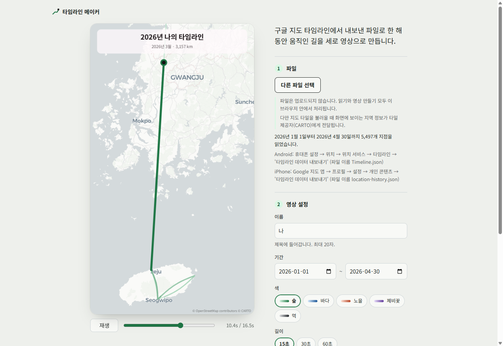
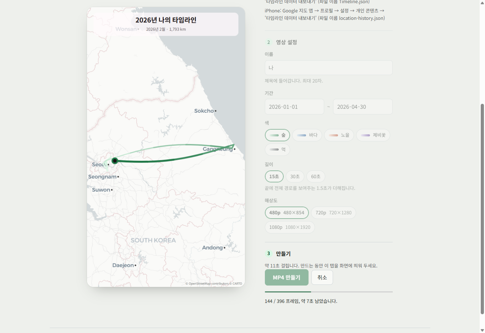
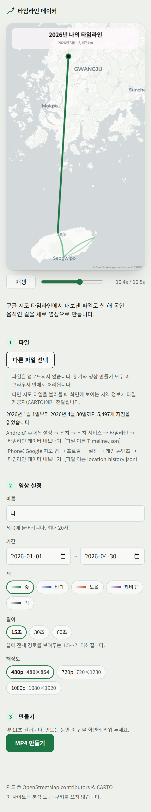

# 타임라인 메이커

휴대폰에서 내보낸 구글 지도 타임라인 파일(`Timeline.json` · iPhone 은 `location-history.json`)로 **한 해 동안 움직인 길을 세로 영상(MP4)** 으로 만드는 웹사이트입니다.
파일은 업로드되지 않고, 읽기부터 영상 만들기까지 모두 브라우저 안에서 처리됩니다.

**사이트: https://rynnkitty.github.io/timeline-maker/**

<p>
  
</p>
<p>
  
  
</p>

> 스크린샷은 모두 **가짜 좌표로 만든 예시 데이터**(`tests/fixtures/`)로 찍었습니다.

## 사용법

1. **파일** — 타임라인 파일을 영상 프레임에 끌어 놓거나 "타임라인 파일 선택"을 누릅니다.
2. **영상 설정** — 제목에 들어갈 이름, 기간(기본: 가장 최근 연도 1월 1일 ~ 마지막 기록), 색(숲·바다·노을·제비꽃·먹), 길이(15·30·60초 + 끝의 전체 경로 1.5초), 해상도(480p·720p·1080p)를 고릅니다. 미리보기에서 바로 확인할 수 있습니다.
3. **만들기** — "MP4 만들기"를 누르면 예상 시간과 진행률이 보이고, 끝나면 파일이 내려받아집니다. 만드는 동안 이 탭을 화면에 띄워 두세요 (다른 탭으로 가면 멈췄다가 돌아오면 이어집니다).

결과 영상: 9:16 세로 · 24 fps · H.264 MP4 · 소리 없음. 15초 영상은 보통 10초 안팎에 만들어집니다 (데스크톱 Chrome 기준).

## 타임라인 파일 내보내기

타임라인 데이터는 휴대폰에 저장되므로 휴대폰에서 내보낸 뒤 컴퓨터로 옮깁니다. 아래는 [Google 지도 도움말](https://support.google.com/maps/answer/6258979?hl=ko)의 절차입니다 (2026-09-23 확인 · 기기와 버전에 따라 메뉴 이름이 다를 수 있습니다).

- **Android** — 휴대폰 **설정** 앱 → 위치 → 위치 서비스 → 타임라인 → **'타임라인 데이터 내보내기'** → 계속 → 저장 위치를 고르고 저장. 파일 이름은 `Timeline.json` 입니다.
- **iPhone · iPad (베타)** — **Google 지도** 앱 → 프로필 사진 → 설정 → 개인 콘텐츠 → **'타임라인 데이터 내보내기'** → 파일에 저장. 파일 이름은 `location-history.json` 입니다. iPhone 에서 내보낸 파일은 형식이 달라 **베타로 지원**합니다. 결과가 이상하면 Android 에서 내보낸 파일로 다시 시도해 보세요.

예전 Google 테이크아웃 형식(`Records.json` · Semantic Location History)은 지원하지 않습니다.

## 개인정보

- 파일은 업로드되지 않습니다. 읽기와 영상 만들기 모두 이 브라우저 안에서 처리됩니다.
- 다만 지도 타일을 불러올 때 화면에 보이는 지역 정보가 타일 제공자(CARTO)에게 전달됩니다.

사이트가 보내는 외부 요청은 지도 타일·스타일·글리프(CARTO) 뿐이고, 폰트와 이미지는 이 사이트에서 직접 제공합니다. 분석 도구와 쿠키는 쓰지 않습니다. 브라우저의 콘텐츠 보안 정책(CSP)으로 다른 곳에 연결할 수 없게 막아 두었습니다.

## 지원 브라우저

- **데스크톱 Chrome · Edge** (최신) — 검증됨.
- 그 밖의 브라우저(Firefox · Safari · 모바일)는 동작할 수도 있지만 검증하지 않았습니다. 영상 인코딩(WebCodecs · H.264)이나 WebGL2 를 지원하지 않으면 안내 문구가 나오고 영상을 만들 수 없습니다.
- 파일은 약 500 MB 까지 읽을 수 있습니다 (200 MB 이상이면 확인을 묻습니다).

## 기술

| 역할 | 사용 |
|---|---|
| 빌드 · 언어 | Vite 8 · TypeScript 6 (프레임워크 없음) |
| 지도 | MapLibre GL JS 6 · CARTO Positron 벡터 타일 (예비: OpenFreeMap) |
| 영상 | WebCodecs (H.264) · Mediabunny (MP4 mux) |
| 파일 읽기 | Web Worker + `JSON.parse` |
| 글꼴 | Noto Sans KR (@fontsource, 자체 호스팅) |
| 테스트 | Vitest · 영상 검증은 Python + OpenCV (`scripts/video-check.py`) |
| 배포 | GitHub Actions → GitHub Pages |

이동 경로는 `timelinePath` 기록만 쓰고, 영상은 **누적 이동 거리에 비례**해 진행합니다 (km 카운터가 일정한 속도로 늘어납니다). 설계 결정은 [`CLAUDE.md`](CLAUDE.md), 측정 기록은 [`docs/`](docs/) 에 있습니다.

## 로컬 개발

Node.js 22.18 이상이 필요합니다.

```bash
npm ci                 # 설치 (git pre-commit 훅도 설정됩니다)
npm run dev            # http://localhost:5173/timeline-maker/
npm test               # 단위 테스트 (Vitest)
npm run build          # dist/ 생성 (CSP 메타 태그는 빌드에만 들어갑니다)
npm run preview        # 빌드 결과 확인
npm run fixtures       # 예시 데이터(가짜 좌표) 다시 만들기
npm run privacy-check  # 커밋된 파일에 실제 좌표 형태의 숫자가 없는지 검사
```

실제 `Timeline.json` 은 저장소에 커밋하지 마세요. `.gitignore` 와 pre-commit 훅이 막아 줍니다. 테스트와 예시에는 `tests/fixtures/` 의 가짜 좌표 데이터만 씁니다.

## 라이선스

- 코드: [MIT](LICENSE)
- 지도 데이터: © [OpenStreetMap](https://www.openstreetmap.org/copyright) contributors (ODbL)
- 지도 스타일·타일: © [CARTO](https://carto.com/attributions) · 예비 제공자 © [OpenMapTiles](https://openmaptiles.org/) · [OpenFreeMap](https://openfreemap.org/)
- 영상 안의 지도 attribution 은 모든 프레임에 들어갑니다.
- 글꼴: Noto Sans KR — SIL Open Font License 1.1
- 라이브러리: MapLibre GL JS — BSD-3-Clause · Mediabunny — MPL-2.0 (수정 없이 사용)

서드파티 라이선스 원문은 [`public/licenses/`](public/licenses/) 에 있고, 사이트에서도 `/timeline-maker/licenses/` 로 제공됩니다.
