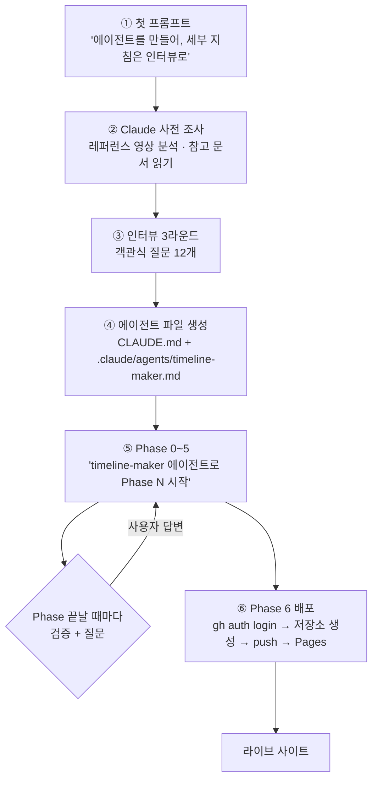
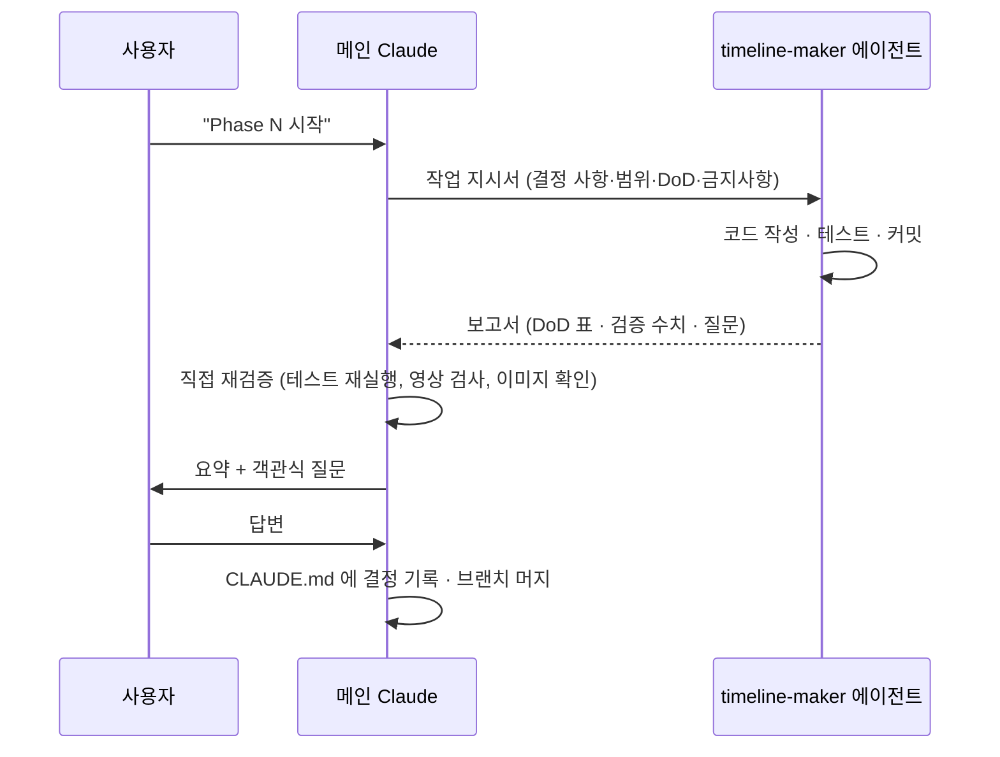

# 타임라인 메이커 제작기 — 프롬프트 한 줄에서 GitHub Pages 배포까지

> **이 문서는 누구를 위한 것인가**
> Claude Code 로 "에이전트를 만들고 → 그 에이전트에게 웹사이트를 만들게 하고 → GitHub 에 배포"하는 과정을 처음 해 보는 사람을 위한 안내서다.
> 이 저장소(`rynnkitty/timeline-maker`)가 실제로 어떤 대화를 거쳐 만들어졌는지, 사용자가 **무엇을 입력했고 Claude 가 무엇을 했는지** 순서대로 보여 준다.
> 마지막 장(§9)에는 같은 방식으로 다음 프로젝트를 할 때 **더 빨리·덜 헤매는 방법**을 정리했다.

- 기간: 2026-09-23 시작 → 2026-09-29 배포
- 결과물: https://rynnkitty.github.io/timeline-maker/
- 사람이 한 일: 프롬프트 약 15개 + 객관식 질문 답변 약 20개 + GitHub 로그인 1회
- 에이전트 작업 시간: Phase 0~6 합계 약 4시간 30분 (Phase 당 25~70분)

---

## 목차

1. [한눈에 보기](#1-한눈에-보기)
2. [시작 전 준비물](#2-시작-전-준비물)
3. [1단계 — 첫 프롬프트: 에이전트를 만들어 달라고 하기](#3-1단계--첫-프롬프트-에이전트를-만들어-달라고-하기)
4. [2단계 — 인터뷰: 객관식으로 요구사항 확정하기](#4-2단계--인터뷰-객관식으로-요구사항-확정하기)
5. [3단계 — 에이전트 파일 두 개가 만들어지다](#5-3단계--에이전트-파일-두-개가-만들어지다)
6. [4단계 — Phase 단위로 일 시키기 (Phase 0~5)](#6-4단계--phase-단위로-일-시키기-phase-05)
7. [5단계 — 배포 (Phase 6)](#7-5단계--배포-phase-6)
8. [사용자가 실제로 입력한 프롬프트 전체](#8-사용자가-실제로-입력한-프롬프트-전체)
9. [다음 프로젝트에서 더 효율적으로 하는 법](#9-다음-프로젝트에서-더-효율적으로-하는-법)
10. [용어집](#10-용어집)

---

## 1. 한눈에 보기



이 프로젝트에는 **세 역할**이 있었다.

| 역할 | 누구 | 하는 일 |
|---|---|---|
| **사용자** | 사람 | 목표를 말하고, 객관식 질문에 답하고, "Phase N 시작"을 지시한다. GitHub 로그인처럼 사람만 할 수 있는 일을 한다 |
| **메인 Claude (오케스트레이터)** | 대화창의 Claude | 인터뷰를 하고, 에이전트를 설계하고, 서브 에이전트에게 일을 맡긴 뒤 **결과를 직접 다시 검증**해서 사용자에게 보고한다 |
| **timeline-maker 에이전트 (실행자)** | 백그라운드 서브 에이전트 | Phase 하나를 맡아 코드를 쓰고, 테스트하고, 커밋하고, 보고서를 돌려준다 |

> 💡 **초급자 포인트** — 사용자는 코드를 한 줄도 쓰지 않았다. 대신 **"무엇을 만들지"와 "고를 것"만** 결정했다. 좋은 결과를 낸 비결은 프롬프트 기술보다 **결정을 문서로 남기는 구조**에 있다(§5).

---

## 2. 시작 전 준비물

시작 시점의 폴더는 이게 전부였다.

```
TimlineMaker/
├─ .claude/
│   ├─ agents/     ← 다른 프로젝트에서 쓰던 범용 에이전트들 (code-reviewer, sprint-planner …)
│   └─ skills/     ← 범용 스킬 17개 (test-driven-development, writing-plans …)
└─ ref/
    ├─ CLAUDE.md          ← 다른 프로젝트에서 쓰던 규칙 문서 (구조 참고용)
    └─ Output_semple.mp4  ← "이런 영상을 만들고 싶다"는 레퍼런스 (16.5초 세로 영상)
```

| 준비물 | 왜 필요했나 |
|---|---|
| **레퍼런스 결과물** (`Output_semple.mp4`) | 말로 설명하기 어려운 "이런 느낌"을 대신한다. Claude 가 영상을 프레임 단위로 재서 사양으로 바꿨다 |
| **참고용 규칙 문서** (`ref/CLAUDE.md`) | 에이전트 문서를 어떤 **구조**로 쓸지 보여 주는 견본 |
| **스킬 폴더** (`.claude/skills/`) | 에이전트가 "테스트 먼저", "공식 문서 확인" 같은 작업 방식을 불러 쓸 수 있게 한다 |
| **실제 입력 데이터** (`Timeline.json`) | 나중에 `ref/private/` 에 넣었다. 파서가 추측이 아니라 **실제 파일 구조**를 기준으로 만들어졌다 |
| 도구 | Claude Code, Node.js, Python(+OpenCV), git, GitHub CLI(`gh`) |

> 💡 **초급자 포인트** — "레퍼런스 + 실제 데이터 + 참고 문서"를 먼저 폴더에 넣어 두는 것만으로 대화가 훨씬 짧아진다. Claude 는 폴더에 있는 것을 직접 읽고 잰다.

---

## 3. 1단계 — 첫 프롬프트: 에이전트를 만들어 달라고 하기

### 3.1 실제로 입력한 프롬프트

먼저 `/effort` 로 작업 강도를 `high` 로 올린 뒤, 아래 문장을 입력했다.

```text
구글 타임라인(Timeline.json)을 바탕으로 ref\Output_semple.mp4 을 만들어 주는 웹사이트를
제작하기 위한 에이전트를 만들어.
에이전트 작성에 필요한 스킬과 도구는 .claude 폴더를 참고하고 ref\CLAUDE.md 파일은
다른 프로젝트제작에 사용했던 에이전트야.
레퍼런스를 참고해서 웹사이트를 제작하고 github에 배포하여 퍼블리싱까지 하는것이 목표야.
구현을 위해 필요한 세부 지침은 나와 인터뷰를 통해 완성하자.
```

### 3.2 이 프롬프트가 잘 작동한 이유

| 요소 | 프롬프트 속 문장 | 효과 |
|---|---|---|
| **입력** | "구글 타임라인(Timeline.json)을 바탕으로" | 무엇을 받아서 |
| **출력 견본** | "ref\Output_semple.mp4 을 만들어 주는" | 무엇을 만드는지 — 파일로 보여 줌 |
| **산출물의 종류** | "웹사이트를 제작하기 위한 **에이전트**를 만들어" | 바로 코드를 짜지 말고 **일할 사람(에이전트)부터** 만들라는 뜻 |
| **참고 자료 위치** | ".claude 폴더를 참고하고 ref\CLAUDE.md 는…" | 어디서 무엇을 보면 되는지 |
| **최종 목표** | "github에 배포하여 퍼블리싱까지" | 끝이 어디인지 |
| **진행 방식** | "세부 지침은 나와 **인터뷰를 통해** 완성하자" | Claude 가 멋대로 정하지 말고 **물어보라**는 지시 — 가장 중요한 한 줄 |

### 3.3 Claude 가 질문하기 전에 한 일 (사전 조사)

인터뷰에 앞서 Claude 는 스스로 알아낼 수 있는 것부터 조사했다.

1. **폴더 전체 훑기**: 참고 에이전트 문서를 읽고 "결정은 `CLAUDE.md` 에, 절차는 에이전트 파일에" 두는 구조를 파악했다.
2. **레퍼런스 영상 분석**: Python+OpenCV 로 프레임 24장을 뽑아 한 장의 시트로 붙여 보고, 수치를 쟀다.
   - 480×854 세로, 24fps, 396프레임(16.5초), H.264, 오디오 없음
   - 상단 카드의 `{연도}년 {이름}의 타임라인 / {월} · {누적 km}`
   - 최근 경로는 진하게, 오래된 경로는 옅게. 카메라는 최근 경로에 맞춰 확대/축소
   - 마지막 1.5초는 전체 경로를 보여 주는 아웃트로
3. **도구 확인**: Node·Python·git·gh 가 있는지, ffmpeg 이 없다는 것, GitHub 에 로그인되어 있지 않다는 것.
4. **외부 사실 확인**: 지도 타일(CARTO) 이용 약관, Timeline.json 의 Android/iOS 형식 차이, 영상 인코딩 라이브러리의 최신 상태를 웹에서 찾아 확인했다.

그리고 **"제가 영상에서 본 것은 이렇습니다. 틀린 게 있으면 알려 주세요"** 라고 분석 결과를 먼저 보여 준 뒤 인터뷰를 시작했다.

> 💡 **초급자 포인트** — 레퍼런스를 말로 설명하지 말고 **파일로 주면**, Claude 가 측정해서 "사양"으로 바꿔 준다. 이후 모든 검증이 "레퍼런스와 같은가?" 로 단순해진다.

---

## 4. 2단계 — 인터뷰: 객관식으로 요구사항 확정하기

Claude 는 `AskUserQuestion` 도구로 **한 번에 2~4개씩, 객관식으로** 물었다. 사용자는 고르기만 하면 된다. 각 질문에는 Claude 가 권하는 선택지에 `(Recommended)` 가 붙어 있고, 직접 입력(Other)도 가능하다.

화면에는 대략 이렇게 보인다.

```text
[렌더링 위치] 영상 렌더링(MP4 생성)을 어디서 할까요?
 ▸ 브라우저 100% (Recommended)   — GitHub Pages 배포 가능, 위치 데이터가 서버로 안 나감
   웹=미리보기, MP4=로컬 스크립트
   백엔드 서버 렌더링              — 위치 데이터 업로드 발생 → 개인정보 이슈
   Other…
```

### 4.1 라운드별 질문과 사용자 답

**라운드 1 — 다른 모든 결정을 좌우하는 것부터**

| 질문 | 사용자 선택 |
|---|---|
| 영상을 어디서 만들까? | 브라우저 100% |
| 샘플 영상을 만든 원본 스크립트가 있나? | 없음 — 영상만 기준 |
| Timeline.json 은 어떤 기기에서 내보냈나? | Android + iOS 둘 다 지원 |
| GitHub 배포 방식은? | 공개 저장소 + GitHub Actions |

**라운드 2 — 영상과 화면 옵션**

| 질문 | 사용자 선택 |
|---|---|
| 해상도 | 9:16 고정 + 480/720/1080 선택 |
| 영상 길이 | 15/30/60초 중 선택 (+ 엔딩 1.5초) |
| 사용자가 바꿀 수 있는 항목 | 이름, 기간, 색상 테마, 미리보기 (전부) |
| 개발용 샘플 데이터 | 실파일은 비공개 폴더에, 테스트는 가짜 좌표로 |

**라운드 3 — 기술과 배포 세부**

| 질문 | 사용자 선택 |
|---|---|
| 기술 스택 | Vite + TypeScript |
| 저장소 이름 | `timeline-maker` |
| UI 언어 | 한국어 전용 |
| 지원 브라우저 | 데스크톱 우선, 모바일은 가능한 만큼 |

### 4.2 Claude 가 스스로 정하고 "확인 요청"한 것

인터뷰에서 묻지 않은 기술적 결정 4가지는 Claude 가 조사해서 제안했고, 사용자가 다음 한 줄로 전부 승인했다.

```text
다른 사내 프로젝트에서 온 파일 삭제하고 네 제안을 모두 수용해. Timeline.json은 Android에서 추출한거야
```

| 제안 | 이유 |
|---|---|
| MP4 제작 라이브러리 = Mediabunny | 기존 라이브러리(mp4-muxer)가 폐기되어 후속으로 교체됨 |
| 지도 = MapLibre + 벡터 타일 | CARTO 래스터 타일은 API 키가 필요해지고 서비스 종료 중 |
| 누적 거리 = 그려지는 경로를 따라 계산 | 화면의 선과 숫자가 일치 |
| 로컬 커밋은 매번 묻지 않기 | 1인 프로젝트라 흐름을 가볍게. **push 는 매번 승인** |

> 💡 **초급자 포인트** — 이 한 줄에는 세 가지 정보가 담겨 있다: ①정리(삭제) 지시 ②제안 일괄 승인 ③새 사실(Android). 답변할 때 **알고 있는 사실을 덧붙이면** 다음 단계의 질문이 줄어든다.

---

## 5. 3단계 — 에이전트 파일 두 개가 만들어지다

인터뷰가 끝나자 Claude 는 **두 파일**을 만들었다. 이 프로젝트 전체를 떠받친 뼈대다. 둘 다 이 저장소에 공개되어 있으니 직접 열어 보자.

| 파일 | 역할 | 비유 |
|---|---|---|
| [`CLAUDE.md`](../CLAUDE.md) | **무엇이 정해졌는가** — 결정·미결·규칙 | 회의록 + 사내 규정 |
| [`.claude/agents/timeline-maker.md`](../.claude/agents/timeline-maker.md) | **어떻게 일하는가** — 절차·완료 기준·금지 사항 | 업무 매뉴얼 |

### 5.1 `CLAUDE.md` — 결정을 세 칸으로 나눈다

```markdown
## 3. 확정 결정 (D-xx)     ← 정해진 것. 번호를 붙여 이후 문서에서 "D-05 에 따라" 처럼 인용
| D-01 | 렌더링·인코딩 100% 브라우저 | 인터뷰 R1 |
| D-05 | 길이 15/30/60초 + 아웃트로 1.5초 | 인터뷰 R2 · 샘플 실측 |

## 4. 미결 (O-xx)          ← 아직 모르는 것. "언제 정할지"와 "현재 권장안"을 함께 적는다
| O-01 | 타일 제공자 CARTO vs OpenFreeMap | Phase 1 실험 후 | 실험해서 비교 |

## 5. 하드 룰 (H-xx)        ← 절대 어기면 안 되는 것
| H-1 | 위치 데이터는 브라우저 밖으로 나가지 않는다 |
| H-2 | 실제 위치 데이터를 커밋하지 않는다 |
```

- **미결(O)을 적어 두는 것**이 핵심이다. 모르는 것을 억지로 정하지 않고 "Phase 1 실험 뒤에 정한다"고 적어 두면, 에이전트가 그 시점에 알아서 질문을 들고 온다.
- 결정이 바뀌면 지우지 않고 **취소선 + 새 번호**로 남긴다. 예: 비공개로 정했던 D-36 을 하루 뒤 D-37 로 번복.
- 문서 끝의 **변경 이력** 표로 "언제 왜 바뀌었나"를 추적한다.

### 5.2 에이전트 파일 — 일하는 방법

`.claude/agents/timeline-maker.md` 의 뼈대는 이렇다.

| 절 | 내용 | 초급자를 위한 설명 |
|---|---|---|
| frontmatter | `name`, `description`, `model` | `description` 에 쓴 문장을 보고 Claude 가 "이 일은 이 에이전트 담당"이라고 판단한다 |
| §0 최우선 규칙 | "작업 전 CLAUDE.md 를 읽는다", "API 를 추측하지 않는다", "모호하면 묻는다" | 모든 작업에 앞서는 원칙 |
| §1 모드 판별 | A 최초 구축 / B 기능 추가 / C 유지보수 | 요청 종류에 따라 절차가 다르다 |
| §2 레퍼런스 사실 | 영상 실측값 표 | "레퍼런스와 같은가?"를 판단하는 기준 |
| §3 Phase 0~6 | 각 단계의 할 일과 **DoD(완료 기준)** | DoD 를 못 채우면 다음 단계로 못 간다 |
| §5 핵심 계약 | 시간 매핑·카메라·거리 계산 규칙 | 구현이 지켜야 할 약속 |
| §8 완료 보고 형식 | 변경/검증/차이/미해결/다음 | 보고가 늘 같은 모양이라 읽기 쉽다 |
| §9 하지 말 것 | 좌표 외부 전송, 실데이터 커밋 … | 사고 방지 |

> 💡 **초급자 포인트** — 같은 내용을 두 파일에 쓰지 않는다. 결정은 `CLAUDE.md` 에만, 절차는 에이전트 파일에만 둔다. 두 곳에 쓰면 **한쪽만 고쳐져서 반드시 어긋난다**.

### 5.3 정리 작업

에이전트를 만든 직후 다음 두 가지를 먼저 했다.

- **`.gitignore` 선작성**: 레퍼런스 영상(실존 인물의 이동 경로와 이름이 담겨 있음), 실제 Timeline.json, 다른 프로젝트 문서가 **실수로라도 커밋되지 않게** 코드보다 먼저 막았다.
- **다른 사내 프로젝트 파일 삭제**: `.claude/` 에 섞여 있던 타 프로젝트 전용 에이전트·스킬·설정을 지웠다.

---

## 6. 4단계 — Phase 단위로 일 시키기 (Phase 0~5)

### 6.1 지시하는 방법 — 이 한 줄이면 된다

```text
timeline-maker 에이전트로 Phase 0 시작
```

그러면 메인 Claude 가 에이전트에게 상세한 작업 지시서를 써서 맡긴다. 에이전트는 백그라운드에서 일하고, 끝나면 보고서를 돌려준다. 메인 Claude 는 그 보고를 **그대로 믿지 않고 다시 확인**한다.



### 6.2 Phase 별 요약

| Phase | 사용자 지시 | 에이전트가 한 일 | 돌아온 질문 → 사용자 답 |
|---|---|---|---|
| **0 사양 고정** | `timeline-maker 에이전트로 Phase 0 시작` | 레퍼런스 사양 문서, 실제 Timeline.json **구조만** 조사(좌표는 출력 금지), 가짜 좌표 테스트 데이터 생성기, ROADMAP | 경로점만 쓸까? / 같은 시각 중복점 처리? / 빈 파일 안내? / 커밋 검사 방식? → **전부 권장안** |
| **1 기반 + 실험** | `timeline-maker 에이전트로 Phase 1 시작` | git 시작, Vite+TS 뼈대, 배포 워크플로 파일, 커밋 전 개인정보 자동 검사, **지도·인코딩 실험(스파이크)** | 지도 타일 CARTO vs OpenFreeMap? / H.264 미지원 브라우저? / main 머지? → **권장안** |
| **2 파서** | `Phase 2 시작` | 테스트를 먼저 쓰는 방식(TDD)으로 Android/iOS 파서, 이상치 제거, 거리 계산. 57MB 실파일로 속도·메모리 측정 | 큰 파일 처리 방식? / 머지? → **권장안** |
| **3 애니메이션** | `timeline-maker 에이전트로 Phase 3 시작하고 최종완성까지 내 승인없이 권고안 대로 진행해.` | 카메라·트레일·헤더 엔진, 미리보기. 레퍼런스 12장면과 **나란히 비교 이미지** 6회 반복 튜닝 | (위임 모드라 질문 없이 진행) |
| **4 MP4 내보내기** | (메인 Claude 가 이어서 지시) | 3개 해상도 MP4 생성, 396프레임 검증, 같은 입력 2회 → 픽셀 동일 확인, 취소 | — |
| **5 화면** | (메인 Claude 가 이어서 지시) | 업로드→옵션→미리보기→내보내기 화면, 오류 안내 7종, 보안 정책(CSP), 스크린샷 | — |

### 6.3 Phase 에서 눈여겨볼 기법

**① 스파이크(실험) 먼저** — Phase 1 에서 본격 구현 전에 "지도를 캔버스로 캡처할 수 있나?", "브라우저에서 H.264 MP4 가 만들어지나?"를 2초짜리 실험으로 먼저 확인했다. 여기서 발견한 함정(지도 워커 파일 404, 캡처 옵션)이 나중 단계의 시행착오를 없앴다.

**② 가짜 데이터로 테스트, 진짜 데이터로 확인** — 실제 위치 기록은 저장소에 절대 넣지 않고, 구조만 똑같은 **가짜 좌표 파일**(`tests/fixtures/`)을 만들어 테스트했다. 실파일로는 "점 몇 개, 몇 km" 같은 **요약 숫자만** 확인했다.

**③ 오라클(정답표)** — 가짜 데이터를 만들 때 "진짜 점이 몇 개인지"를 함께 기록해 두고(`expected.json`), 파서 결과와 대조했다. 대조 중 파서가 아니라 **데이터 생성기 쪽 버그**를 찾아냈다.

**④ 레퍼런스와 나란히 놓기** — Phase 3 의 판정 기준은 "레퍼런스 12장면 vs 우리 렌더링"을 한 장에 붙인 이미지였다. 결과적으로 레퍼런스를 다시 재서 **원래 계획을 고친** 결정도 두 개 나왔다.
  - 영상 진행 = 시간이 아니라 **누적 거리**에 비례 (레퍼런스의 km 카운터가 일정한 속도로 증가)
  - 지나간 트레일은 약 **3초 뒤 사라짐** (레퍼런스에서 오래된 선이 보이지 않음)

**⑤ 메인 Claude 의 독립 검증** — 에이전트가 "통과"라고 보고해도, 메인 Claude 는 매번 테스트를 다시 돌리고, 만들어진 MP4 를 직접 검사하고, 비교 이미지를 열어 봤다. 보고서는 **주장**이고 검증은 **사실**이다.

### 6.4 위임 — "내 승인 없이 권고안대로"

Phase 3 에서 사용자는 이렇게 지시했다.

```text
timeline-maker 에이전트로 Phase 3 시작하고 최종완성까지 내 승인없이 권고안 대로 진행해.
```

메인 Claude 는 이 위임의 **범위를 먼저 문서로 고정**했다(`CLAUDE.md` D-23).

- ✅ 위임됨: 남은 미결은 권장안으로 결정, 룩앤필은 비교 이미지로 자체 판정, 브랜치 머지, 이 저장소 생성·push·Pages 설정
- ❌ 위임 안 됨: 다른 저장소, 계정 설정, **자격 증명 처리**, 삭제·강제 push

Phase 6 에서 "회사 이메일이 커밋에 들어 있다 → 이력을 다시 써야 한다"는 결정이 나왔다. 이력 재작성은 위 목록에 **명시되어 있지는 않았지만**, 공개 뒤에는 되돌릴 수 없는 일이라 위임 중이었어도 멈추고 사용자에게 물었다. 위임 문구가 모든 경우를 적을 수는 없으므로, **"되돌릴 수 있는가?"** 가 마지막 판단 기준이 된다.

> 💡 **초급자 포인트** — "알아서 해"는 편하지만, **무엇을 알아서 해도 되는지** 한 줄로 적어 두면 사고가 안 난다.

---

## 7. 5단계 — 배포 (Phase 6)

### 7.1 로컬 준비 (인증 없이 할 수 있는 것)

- README, MIT 라이선스, 서드파티 라이선스 원문
- **git 이력 전체 점검**: 실데이터·레퍼런스 파일·토큰 문자열이 한 번이라도 커밋된 적 있는지
- 배포 워크플로 점검: `npm ci → 개인정보 검사 → 테스트 → 빌드 → 배포`
- 빌드 결과물로 전체 흐름 재확인 (빠진 파일 0건)

### 7.2 공개 직전에 나온 질문 두 개

| 질문 | 왜 중요했나 | 사용자 선택 |
|---|---|---|
| 모든 커밋에 **회사 이메일**이 작성자로 들어 있다. 공개할까? | push 하면 영구 공개. **push 전에만** 바꿀 수 있다 | GitHub noreply 주소로 이력 재작성 |
| Claude 설정(`CLAUDE.md`, `.claude/`)도 공개할까? | 개발 과정 문서가 외부에 보인다 | 처음엔 비공개 → **다음 날 공개로 번복** (유사 에이전트 제작 참고용) |

이메일 변경은 `git filter-repo` 로 전체 이력을 다시 쓰는 작업이라, 먼저 **전체 백업(bundle)** 을 만든 뒤 진행했다.

### 7.3 GitHub 로그인 — 사람만 할 수 있는 일

프롬프트 창에서 `!` 를 붙이면 명령이 대화 세션 안에서 실행된다.

```text
! gh auth login
```

→ 화면에 나온 코드를 브라우저(https://github.com/login/device)에 입력하면 로그인 완료.

### 7.4 배포 명령 (Claude 가 실행)

```bash
# 1) 공개 저장소 생성 + 연결 (아직 push 안 함)
gh repo create rynnkitty/timeline-maker --public --source . --remote origin

# 2) Pages 를 "GitHub Actions 로 배포" 방식으로 먼저 켜 둔다 → 첫 배포가 실패하지 않는다
gh api -X POST repos/rynnkitty/timeline-maker/pages -f build_type=workflow

# 3) push → Actions 가 자동으로 테스트·빌드·배포
git push -u origin main

# 4) 확인
gh run list --workflow deploy.yml
```

배포 뒤 라이브 주소에서 가짜 데이터로 **전체 흐름을 한 번 더** 돌렸다. 업로드 → 미리보기 → 내보내기 → 다운로드가 되는지, 오류 0건인지, 받은 MP4 가 레퍼런스와 같은 규격(480×854·24fps·396프레임)인지 확인했다.

### 7.5 배포에서 생긴 일 (그리고 교훈)

| 일어난 일 | 교훈 |
|---|---|
| gh 로그인 토큰에 `workflow` 권한이 없어서 워크플로 파일이 든 첫 push 가 막힐 뻔했다 | 로그인할 때 `gh auth refresh -h github.com -s workflow` 까지 한 번에 해 둔다 |
| 사용자가 **개인 액세스 토큰을 채팅창에 두 번 붙여 넣었다** | 채팅에 붙인 토큰은 대화 기록에 남는다 → **즉시 폐기**가 원칙. 토큰 대신 `! gh auth login` 을 쓴다. (Claude 는 push 명령 두 번에만 썼고, git 설정·원격 URL·자격 증명 저장소 어디에도 남기지 않았다) |
| 회사 이메일이 커밋 37개에 들어 있었다 | 저장소를 만들자마자 `git config user.email <noreply 주소>` 부터 설정한다 |
| Claude 설정을 비공개로 이력에서 지웠다가 다음 날 공개로 바꿨다 | 공개 범위를 **처음 인터뷰에서** 정하면 이력 재작성을 두 번 할 일이 없다 |

---

## 8. 사용자가 실제로 입력한 프롬프트 전체

시간 순서다. (토큰 값은 가렸다.)

| # | 시점 | 입력 | 결과 |
|---|---|---|---|
| 0 | 시작 | `/effort` → high | 작업 강도 설정 |
| 1 | 09-23 | (§3.1 의 첫 프롬프트) | 사전 조사 → 인터뷰 |
| 2 | 〃 | 인터뷰 3라운드 객관식 답변 12개 | 요구사항 확정 |
| 3 | 〃 | `다른 사내 프로젝트에서 온 파일 삭제하고 네 제안을 모두 수용해. Timeline.json은 Android에서 추출한거야` | 에이전트 확정 · 정리 |
| 4 | 〃 | `timeline-maker 에이전트로 Phase 0 시작` | 사양·스키마·테스트 데이터 |
| 5 | 〃 | 질문 4개 → 전부 권장안 | 결정 D-16~D-18 |
| 6 | 〃 | `timeline-maker 에이전트로 Phase 1 시작` | 뼈대·실험 |
| 7 | 〃 | 질문 3개 → 전부 권장안 | 결정 D-19·D-20, 머지 |
| 8 | 〃 | `Phase 2 시작. 그리고 github 정보를 알려줄께 id: rynnkitty, tokken: ghp_****` | 파서 · 계정 기록 (토큰은 사용하지 않고 폐기 권고) |
| 9 | 〃 | 질문 2개 → 전부 권장안 | 결정 D-22, 머지 |
| 10 | 〃 | `timeline-maker 에이전트로 Phase 3 시작하고 최종완성까지 내 승인없이 권고안 대로 진행해.` | 위임(D-23) → Phase 3·4·5·6(로컬) 연속 진행 |
| 11 | 09-28 | 질문 2개: 이메일 → noreply, 공개 범위 → 전부 비공개 | 이력 재작성 |
| 12 | 09-29 | `계속진행해` | (세션이 끊긴 뒤) ROADMAP 을 보고 이어서 진행 |
| 13 | 〃 | `! gh auth login` | GitHub 로그인 |
| 14 | 〃 | `내가 액세스 토큰을 줄께 그걸 사용할래? ghp_****` | 권한 확인 후 push 두 번에만 명령 한정으로 사용(저장 안 함) → 배포 완료. 이후 push 는 gh 로그인으로 |
| 15 | 〃 | `.claude 폴더의 내용도 푸쉬해줘` → `CLAUDE.md도 푸쉬해. 나중에 유사항 에이전트 제작할때 참고하려고해` | 공개 전 민감정보 검사 → 공개 전환(D-37) |
| 16 | 〃 | 이 가이드 작성 요청 | 이 문서 |

> 💡 **초급자 포인트** — 코딩 지시는 사실상 **"Phase N 시작"** 뿐이었다. 나머지는 전부 **선택**이었다. 좋은 에이전트 문서가 있으면 사람의 일은 "고르기"로 줄어든다.

---

## 9. 다음 프로젝트에서 더 효율적으로 하는 법

이번 과정에서 시간이 새거나 되돌린 지점을 기준으로 정리했다. 효과가 큰 순서다.

### 9.1 첫날 "환경 세팅"을 먼저 끝낸다 ⭐ 가장 효과 큼

이번에 막판에 터진 문제들(로그인, 권한, 회사 이메일)은 전부 **첫날 5분**이면 막을 수 있었다.

```bash
! gh auth login                                   # 브라우저 로그인 (토큰 붙여넣기 금지)
! gh auth refresh -h github.com -s workflow       # 워크플로 파일 push 권한 추가
git config user.email "<GitHub ID>+<계정>@users.noreply.github.com"   # 회사 이메일 노출 방지
```

- noreply 주소는 GitHub → Settings → Emails 에서 확인할 수 있다.
- 이렇게 하면 **이력 재작성(filter-repo)이 필요 없다.**

### 9.2 첫 프롬프트에 "이미 아는 답"을 넣는다

인터뷰 12문항 중 상당수는 사용자가 이미 답을 알고 있었다. 첫 프롬프트에 적어 두면 인터뷰가 1라운드로 줄어든다. 아래 템플릿을 채워서 쓰자.

```text
[목표] {입력}을 받아 {레퍼런스 파일 경로} 같은 결과물을 만드는 웹사이트를 만들 에이전트를 만들어.
       목표는 GitHub Pages 배포까지.
[참고] 스킬·도구는 .claude 폴더, 문서 구조는 {참고 CLAUDE.md 경로} 참고.
[이미 정한 것]
 - 처리 위치: 브라우저에서만 (데이터 업로드 금지)
 - 스택: Vite + TypeScript / UI 언어: 한국어
 - 배포: 공개 저장소 {계정}/{저장소명}, GitHub Actions → Pages
 - 공개 범위: 코드 + CLAUDE.md + .claude/ 공개, ref/ 와 실데이터는 비공개
 - 커밋 이메일: noreply (이미 설정함), gh 로그인·workflow 권한 완료
 - 실데이터 샘플: ref/private/ 에 넣어 둠 (Android, iOS)
[진행 방식] 위에 없는 세부 지침만 인터뷰로 정하자.
           에이전트가 완성되면 Phase 0 부터 권고안대로 진행하되,
           ① 룩앤필 비교 이미지 ② 공개 저장소 첫 push 직전 — 이 두 곳에서만 나에게 확인받아.
```

### 9.3 위임은 처음부터, 대신 "확인 지점"을 지정한다

이번에는 Phase 0~2 에서 매번 질문에 답하다가 Phase 3 에서 위임으로 바꿨다. 질문 대부분이 **권장안 그대로** 선택됐으므로, 처음부터 위임하고 **꼭 봐야 할 지점만** 지정하는 편이 빠르다.

- 사람이 봐야 하는 곳: **눈으로 판단하는 것**(룩앤필), **되돌릴 수 없는 것**(공개 push, 이력 재작성, 삭제)
- 나머지(라이브러리 선택, 파서 세부 정책 등)는 권장안 + 기록이면 충분

### 9.4 배포 파이프라인을 Phase 1 에 한 번 뚫어 둔다

이번에는 배포(Phase 6)를 마지막에 처음 해 봤고, 그때 로그인·권한 문제가 한꺼번에 드러났다. Phase 1 에서 **"Hello" 페이지를 실제로 Pages 에 배포**해 보면, 인증·권한·`base` 경로 문제를 초반에 해결할 수 있다. (단, 공개 범위와 이메일 설정이 먼저 끝나 있어야 한다 — §9.1)

### 9.5 Phase 마다 새 에이전트를 띄우고, 인계는 ROADMAP 으로

이번에는 한 에이전트를 Phase 0~6 내내 이어서 썼다. 맥락이 유지되는 장점은 있었지만, 에이전트가 들고 있는 대화가 Phase 마다 불어나 비용이 커졌다. `docs/ROADMAP.md` 에 "다음 세션 명령"과 "미해결(Carry-over)"을 적어 두는 구조가 이미 있으므로, **Phase 마다 새 에이전트로 시작해도** 이어서 일할 수 있다. 실제로 세션이 끊긴 뒤 `계속진행해` 한 마디로 이어서 진행된 것도 이 구조 덕분이었다.

### 9.6 에이전트 문서를 템플릿으로 재사용한다

이 저장소의 [`CLAUDE.md`](../CLAUDE.md) 와 [`.claude/agents/timeline-maker.md`](../.claude/agents/timeline-maker.md) 를 새 프로젝트의 출발점으로 쓰자.

- 그대로 쓸 수 있는 것: 결정(D)/미결(O)/규칙(H) 표 구조, 모드 A/B/C, Phase + DoD 형식, 완료 보고 형식, 하지 말 것 목록, 개인정보 규칙(H-1·H-2·H-5), 커밋 전 검사 스크립트(`scripts/privacy-check.ts`)
- 바꿔야 하는 것: §2 레퍼런스 사실, §5 핵심 계약, Phase 별 작업 내용
- 더 나아가면 이 구조 자체를 `skill-creator` 로 **"프로젝트 에이전트 부트스트랩" 스킬**로 만들어 두면, 다음부터는 스킬 한 번 호출로 뼈대가 생긴다.

### 9.7 자잘하지만 시간을 아끼는 것들

| 팁 | 이번에 겪은 일 |
|---|---|
| 반복 확인 명령(`npm test`, `git status` 등)은 권한 허용 목록에 넣어 둔다 (`/fewer-permission-prompts`) | 확인 명령마다 권한 창이 뜸 |
| 검증 스크립트를 처음부터 만들어 재사용한다 | `scripts/video-check.py` 하나로 Phase 0·1·4·6 영상 검증을 전부 처리 |
| Windows + Git Bash 에서는 백그라운드 개발 서버가 안 꺼질 수 있다 | 포트를 점유한 옛 서버가 잘못된 응답을 줘서 측정이 꼬임 → PID 로 종료 |
| 한글 경로에서 OpenCV `cv2.imwrite` 가 오류 없이 실패한다 | `cv2.imencode(...).tofile(...)` 로 우회 |
| 실데이터는 두 기기(Android/iOS) 모두 미리 준비한다 | iOS 는 끝까지 실파일로 검증하지 못해 "베타"로 남음 |

---

## 10. 용어집

| 용어 | 뜻 |
|---|---|
| **에이전트 (서브 에이전트)** | 특정 역할과 절차가 적힌 문서(`.claude/agents/*.md`)를 가진 Claude. 메인 대화와 별도로 백그라운드에서 일하고 보고서를 돌려준다 |
| **스킬** | "테스트 먼저 작성", "공식 문서로 확인" 같은 작업 방식을 담은 문서(`.claude/skills/*/SKILL.md`). 에이전트가 필요할 때 불러 쓴다 |
| **CLAUDE.md** | 프로젝트 규칙 문서. Claude 가 세션을 시작할 때 자동으로 읽는다 |
| **오케스트레이터** | 여러 에이전트에게 일을 나눠 주고 결과를 검증·종합하는 역할. 여기서는 메인 대화의 Claude |
| **Phase / DoD** | 작업 단계 / 그 단계의 완료 기준(Definition of Done). DoD 를 못 채우면 다음 Phase 로 넘어가지 않는다 |
| **스파이크** | 본 구현 전에 "이게 되나?"만 확인하는 작은 실험 코드 (`spikes/`) |
| **TDD** | 테스트를 먼저 쓰고, 그 테스트를 통과하도록 코드를 쓰는 방식 |
| **픽스처 / 오라클** | 테스트용 입력 데이터 / 그 입력의 정답표 |
| **ROADMAP.md** | 진행 현황·다음에 할 일·미해결 목록. 세션이 끊겨도 여기서 이어간다 |
| **gitignore** | git 이 무시할 파일 목록. 실데이터·비밀 파일을 커밋에서 원천 차단한다 |
| **pre-commit 훅** | 커밋 직전에 자동으로 도는 검사. 여기서는 좌표 패턴·금지 경로를 검사한다 (`.githooks/pre-commit`) |
| **GitHub Actions / Pages** | push 하면 자동으로 테스트·빌드하는 서비스 / 그 결과를 정적 웹사이트로 호스팅하는 서비스 |
| **CSP** | 웹페이지가 접속할 수 있는 외부 주소를 제한하는 보안 정책. 위치 데이터가 새 나갈 길을 막는다 |
| **이력 재작성 (filter-repo)** | 이미 만든 커밋들의 내용·작성자를 바꾸는 작업. **공개 push 전에만** 안전하다 |
| **noreply 이메일** | GitHub 이 주는 `ID+계정@users.noreply.github.com` 주소. 개인·회사 이메일을 커밋에 노출하지 않게 해 준다 |
| **`!` 명령** | Claude Code 프롬프트에서 `! 명령어` 로 입력하면 사람이 직접 실행한 것처럼 세션 안에서 돈다 (로그인처럼 사람이 해야 하는 일에 사용) |
